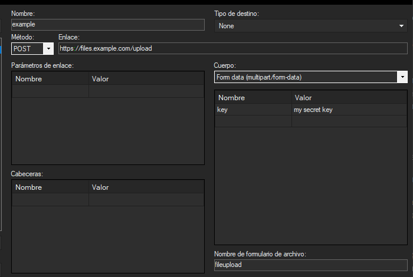

Self-hosting with BSXU
March 29, 2024
Leverage ShareX, Backblaze B2 and your webserver to hold and serve your own files easily.

---

### Prelude

One year ago, almost to the day, I made a very similar blogpost showing off [PSXU](https://markski.ar/blog/sharex-self-host-with-psxu).

BSXU is a continuation to it, and the reasons are much the same: The unreliability of free hosting and the inconvenience of paid one.

If you are a technical enough person, it's not unlikely that you are already running your own web server, and it's not unlikely that you're already familiar with the concept of object storage.

While PSXU only stores files in your webserver, BSXU can use Backblaze B2 for long term storage. This allows you to treat your webserver as a disposable thing, not having to worry about your own data's integrity.

This post is about leveraging ShareX, Backblaze's B2 object storage, and your web server in order to self-host your stuff. Not only will this allow you to quickly share screenshots with a keybind, but just about any file, of any size.

### Prerequisites

- A web server, with a reasonable amount of space for caching files, and running Python 3.10 (Ubuntu Server's default) or newer.
- A computer running ShareX or equivalent software.
- Optionally, a free [Backblaze](https://backblaze.com) account. B2's free tier comes with 10 gigs of object storage. 
- ~20 minutes of your time.


### Downloading and configuring BSXU
First, if you want to use B2, create a bucket in Backblaze. Name it whatever you want.

Then head to "applications" in the sidebar, and create a new application key. Take note of it's ID and token key.

Now grab BSXU from its [Github releases page](https://github.com/markski1/BSXU/releases/latest). Simply download the Source code in ZIP form, and uncompress it in a folder.

Once done, copy the `.env.example` file, and call the new copy `.env`. This will hold the enviroment variables, the "configuration" if you will.

Then simply open `.env` and fill in the blanks. They are sufficiently commentated regarding what is what.

If you're not using Backblaze, set 'USE_B2_STORAGE' to false, and ignore the B2_* fields.

### Setting up the server
1. Upload the contents of the 'src' folder to wherever you wish the application to run.
2. Install the deps: `pip install -r requirements.txt`
3. Run the application: `flask run`

There's many ways to run a Flask application. Honestly, you could just throw `flask run` into a `screen` and call it a day. But you can look up how to set up a Flask app to run with Waitress if you want to do things proper.

Do not use a multi-worker solution if you want to enable the webpanel. The webpanel is not stateless and won't work with Gunicorn or other multi-worker WSGI's. 

#### Setting up the domain

You can keep it this way and have the port specified exposed now (i.e. `example.com:5000/file.png`). However, that's not very pretty.

Assuming you use nginx, you can simply proxy_pass a domain to it.

In my case, for `file.markski.ar`, I do it as follows:

```
{...}

root [redacted];
index index.html index.htm index.php;
server_name file.markski.ar;

client_max_body_size 1024M;  # max file size

location / {
    proxy_pass http://127.0.0.1:5000;
    proxy_http_version 1.1;
    proxy_set_header Upgrade $http_upgrade;
    proxy_set_header Connection 'upgrade';
    proxy_set_header Host $host;
    proxy_cache_bypass $http_upgrade;
}

access_log /var/www/logs/file.access.log;
error_log  /var/www/logs/file.error.log error;

{...}
```

### If on Windows, set up ShareX

Open Sharex, head to "destinations" and then Custom Uploader Settings.

Create a new uploader, and fill in the blanks:

- Name: A name for the uploader. Can be anything.
- Request URL: The path to /upload.
- Method: POST
- File form name: fileupload
- Finally, add a field named "key", where the value is your AUTH_KEY, without the quotes.

It should end up looking something like this:



Use the test buttons on the bottom left to ensure upload functions work. If they do, simply close the window, if they don't, read the error message and check the guide to make sure you did things correctly.

Finally, set your default upload settings to it in the Destinations menu.

### If on Linux, set up Flameshot.

Grab the 'flameshot-bsxu.py' file from the flameshot-addon folder in the repository. Fill in the blanks in the config dictionary.

The command you'll want is `flameshot gui -r | python3 /path-to-wherever-is/flameshot-bsxu.py`

Just bind that to a key.

### If on MacOS, let me know.

I have no clue what MacOS users use for screenshots. If you figure something out let me know and I'll add it here.

### You're done
Congratulations, you are now self-hosting. Hit me up if any problems arise, or open an issue/pr in the Github repo as seems appropiate.