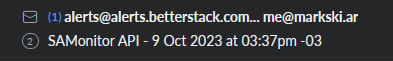

Monitoring the uptime of your stuff? Easier than you may think!
October 9, 2023
Once you're running a few hobby projects, you'll want to be the first to know when they fall.

### Prelude
While I've been running hobby projects of my own in excess of a decade now, only recently have I began running a few on my own server. Namely [SAMonitor](https://sam.markski.ar/) and [Rosettes](https://markski.ar/rosettes).

Running stuff on your own server is pretty nifty. It's a learning path into DevOps, to some extent, and if you're smart about your choices it makes things rather cheap. You get full control of where and how your stuff will run, what domains and ports it'll run on, among other stuff.

It's a form of freedom! And as such, a responsability. When you're running your own infrastructure, you are the person in charge of your things being online and -staying- online.

This has taught me a few things:

- No matter how well-written, software -will- crash if enough stars align.
- Even if your software itself doesn't crash on its own, something else can (and will) take it out.
- Your users, especially non-technical users, will not always tell you when your stuff stops working, they'll just shrug and assume "it'll probably work later".
- Running your software as system services is a neat way to ensure quick restarts, but sometimes you'll reach a state where even that won't work.

All above in mind, I have decided to set something up to let me know when things crash.


### Process

Like every developer running hobby projects, I like things cheap. You know what's better than cheap? Free!

BetterStack is what I would describe as a "stability insights" service, offering a bunch of powerful of logging, troubleshooting and monitoring tools. The latter is the one relevant to today's matter.

The first step is to head on over to [betterstack.com](https://betterstack.com/) and make an account. The free plan offers 10 monitors, e-mail alerts, and a Status page - I'll adress that bit too.

Out of the gate you will be asked for a phone number. Paid plans offer phone-calls if you fail to acknoweldge downtime after long enough, but with the free plan this won't concern you. Once you verify your e-mail and reach the user dashboard, you'll immediatly be able to set up your first monitor.

It really is as simple as giving it a name, making a few choices like how often to check and from where, and of course what URL to check. As an example, in the case of SAMonitor, I made a simple `CheckAlive` endpoint which just returns a string for it to ping.

```
[HttpGet("CheckAlive")]
public string CheckAlive()
{
    return "SAMonitor lives!";
}
```
   
You can save that monitor and... yeah, that's all, really! Rinse and repeat for however many things you want to check on.

As far as the status pages go, simply head on over to the status pages sidebar, click create a new one, and it'll very much hold your hand through the whole process. You can set a logo, customize a few things and even use your very own email.

In less than 30 minutes, I (and perhaps you) got full uptime monitoring for all my stuff, and got to keep my CC number to myself. I'd say that's pretty good!

### Results
By the end of this all, I got two two things:

1. Email alerts whenever something goes down


2. A nifty little status site at [status.markski.ar](https://status.markski.ar/) which, I can't imagine anyone would ever care to check, but hey, why not?
