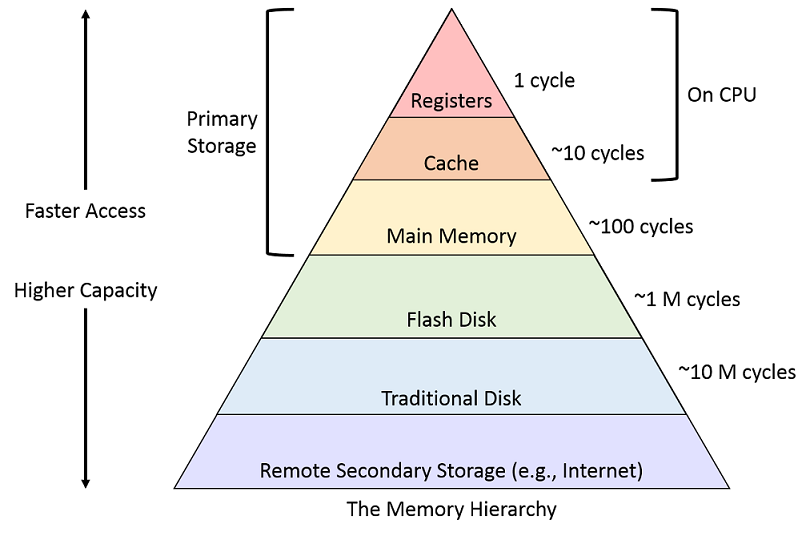

The principle of locality
December 19, 2023
From the heart of the machine, random access memory is not all that random.

---

In this article, I'll visit what I've found to be a fascinating problem in computer science, often overlooked by many types of developers who maybe don't have to concern with this level of lack of abstraction.

Even if this doesn't apply in the type of work you do, I believe you might find it interesting either way.

### Summary

- [Prelude](#prelude)
- [The cost of Random Access](#the-cost-of-random-access)
  - [Memory Wall](#memory-wall)
- [Example scenario](#example-scenario)
  - [Hardware](#hardware)
  - [Problem](#problem)
- [Solution](#solution)
  - [Bandwidth joins the server](#bandwidth-joins-the-server)
  - [Linear access joins the server](#linear-access-joins-the-server)
- [The point](#the-point)
  - [On manually allocating data](#on-manually-organizing-data)
- [Sources](#sources)


## Prelude
In the introductory classes of computer science theory, a pyramid representing the "computer memory hierarchy" is one of the first things to be burned into our minds.



I am not a fan of the measurements in cycles, since of course there's a lot of processor types and they all do things a bit different. But it seems like a sufficiently accurate assumption to make that, that, as you move down the pyramid, you'll see latency increases of around an order of magnitude.

To revisit the top 3, marked as primary storage.

- Registers are very small segments of memory which are right in the CPU's execution unit. There's many of them, largely a power of 2 amount of bits (with few exceptions) each. To access them is pretty much instantaneous.
- Cache is located in the CPU die. Nowadays it's rather generous with even entry level CPU's having dozens of megabytes. To access it has a cost but it's also ridiculously quick.
- Memory is of course what is commonly referred as "RAM". Random access memory. By all accounts, it can also be incredibly fast, but we will learn that it's not free, or nearly as "instantaneous".

From the programmers standpoint, you only ever interact with memory. Registers are used by the CPU to store interim data of whatever operation is executing, and cache is managed entirely by the chip (more on this later).

## The cost of Random Access

It seems intuitive from the name to assume that randomly accessing data in random access memory shouldn't have any penalties. And if all there were to the story was accessing memory, you'd be right, but when you consider *cache* it suddenly isn't that simple anymore.

### Memory Wall

In many applications, the limitation is found in the memory system, not in the processor. The two main parameters are latency and, to a lesser extent, bandwidth.

## Example scenario

I find matrix multiplication to be an excelent example for memory locality problems. It is, after all, one of the most common operations in many High Performance Computing applications.

### Hardware

Let's assume a processor capable of executing one instruction per nanosecond. This system's memory has an access latency of 100 nanoseconds.

Such a system would have a peak theoretical performance of 1000 MFlops (1 second = 1.000.000.000 nanoseconds = 1.000.000.000 floating point operations in a second)

### Problem

**Suppose** we wish to multiply two matrixes, A and B, each of size N * N (where N is any positive integer). We want 

We will need N^3 addition and multiplication operations, or N^3 nanoseconds worth of compute time. For each operation however, we'll need 200 nanoseconds to fetch both operands, and 100 nanoseconds to store the result.

With **N=32**, we find that:

- We'll need 2*(32^3) operations of sum/multiplication ops. (65,536ns total)
- We'll need to fetch both operands from memory per each operation. (6,553,600ns total)
- We'll need to store each result in memory. (102,400ns total)

In total, it'll take 6,721,536 nanoseconds to resolve 2^16 operations.

***Our theoretical performance of 1 GFlop has plumetted to 9,75 MFlops.***

## Solution

As you may have guessed, we want to reduce the time it takes to fetch and write from memory. This is where CPU cache saves the day.

- When CPU needs data, first it checks cache.
- If data is in cache, a 'cache hit' is produced. The request is satisifed almost instantly.
- If data is absent, we have a 'cache miss', data must be grabbed from RAM, stored in cache, and then the request is satisfied.

Cache hitrate is important as it directly affects system latency.

Let's add a 32kb cache to our initial proposed hardware. It has an access time of 4ns. Now let's revisit the problem.

And consider that our 32x32 matrixes will fit in the cache.

- We'll need to do just as much compute. (65,536ns total)
- For each operation, we have to fetch both operands. The first fetch will miss the cache, but after that, it'll be in cache. ( (96+4*N) * 2N^2 = 224 * 2048 = 458,752ns)
- We'll still need to store each result in memory. (102,400ns total)

In total, it'll take 626,688 nanoseconds to resolve.

***Our previous theoretical performance of 9,75 MFlops has increased to 104,6 MFlops.***

This improvement is based on the assumption that there'll be a repetition of references to certain data in a short time window. 

This is what we call ***Temporal Locality***. Moving on...

### Bandwidth joins the server

Bandwidth is the speed wherein data can be transferred from memory to CPU. A common technique to improve it is to increase the blocksize of data transfered per clock cycle.

Continuing with our theoretical hardware, let's now say the blocksize is 4 times that of an element of the matrix.

We'll now do the same operation on this machine.

- We'll need to do just as much compute. (65,536ns total)
- For each operation, we have to fetch both operands. The first fetch per element will also miss cache, but fetch 4 items each time. ( (24+4*N) * 2N^2 = 152 * 2048 = 311,296ns)
- We'll still need to store each result in memory, but only one access per 4 writes. (25,600ns total)

In total, it'll take 402,432ns to resolve.

***Our previous theoretical performance of 104,6 MFlops has increased to 162,8 MFlops.***

This improvement is based on the succesive instructions using data located in consecutive memory spaces.

This is what we call ***Spatial Locality***. Moving on...

### Linear access joins the server

As a callback to the start of the post, randomly accessing random access memory can actually have a performance impact depending on the problem.

Consider the following loop in which we multiply the total sum of B by columns.

```
for (i = 0; i < 1000; i++) {
    sum[i] = 0.0;
    for (j = 0; j < 1000; j++) {
        sum[i] += B[j][i];
    }
}
````

We are going through B's elements by columns. Now what happens if the B matrix is in memory by consecutive rows? **We are not taking advantage of spatial locality**. Every initial fetch of an element will result in a cache miss. What's worse, if B is too large for our CPU's cache, we won't even get to benefit from temporal locality!


## The point

- Temporal and spatial locality are essential and must be exploited for the best performance.
- Number of operations is a good indicator of performance, but number of memory accesses will yield the most important results in terms of real-world time.
- The way data is ordered in memory, and how the program goes around fetching it, can have a significant impact and should not be obviated.

### On manually organizing data

Well, if the language has an opinionated choice of how it'll allocate your matrix, how do you solve this?

By manually allocating it! In the case of C, as an example, you can just allocate for the total size of elements a matrix will have.

`float * M = malloc( N * N * sizeof(float) );`

Now you can use whatever order you want. After all, you now just have a really large memory space to store all the numbers you need, and it's up to you in what order you'll write and read from it. (For example, column ordered: `r*N+c` ; row ordered: `c*N+r`)

Matrixes are my go-to example, but you probably get the point: You got a big chunk of memory and you can put whatever you want, however you want in it.

## Sources

- "Introduction to High Performance Computing for Scientists and Engineers". Georg Hager, Gerard Wellein. (2011)
- The examples are largely based in those given in a Parallel Systems class I took in the National University of La Plata in early 2023.
- The memory hierarchy pyramid graphic was taken from the blog of the Computer Science department of Swarthmore College.